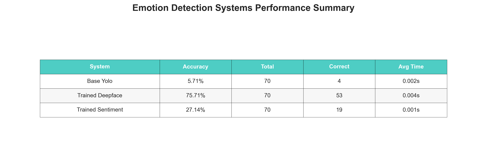

# Emotion Detection Systems Evaluation

This folder evaluates three emotion detection systems using the same validation dataset for fair comparison.

## Systems Being Tested

1. **Base-YOLO** - Simple rule-based approach using OpenCV
2. **Trained-DeepFace** - Pre-trained DeepFace models  
3. **Trained-Sentiment** - Custom trained neural network

## Current Results



## What We Measure

- **Accuracy** - How often each system gets the emotion right
- **Speed** - How fast each system processes images
- **Memory Usage** - How much RAM each system needs

## Quick Start

```bash
# Run complete evaluation
./run_evaluation.sh

# Or run individually:
python3 evaluate_separate.py    # Run evaluation
python3 generate_graphs.py     # Generate charts
```

## Files

- **`evaluate_separate.py`** - Main evaluation script
- **`generate_graphs.py`** - Creates comparison charts
- **`run_evaluation.sh`** - Complete evaluation pipeline
- **`requirements.txt`** - Python dependencies

## Output

The evaluation generates comparison data and visualizations including accuracy charts, speed comparisons, and performance summaries.
